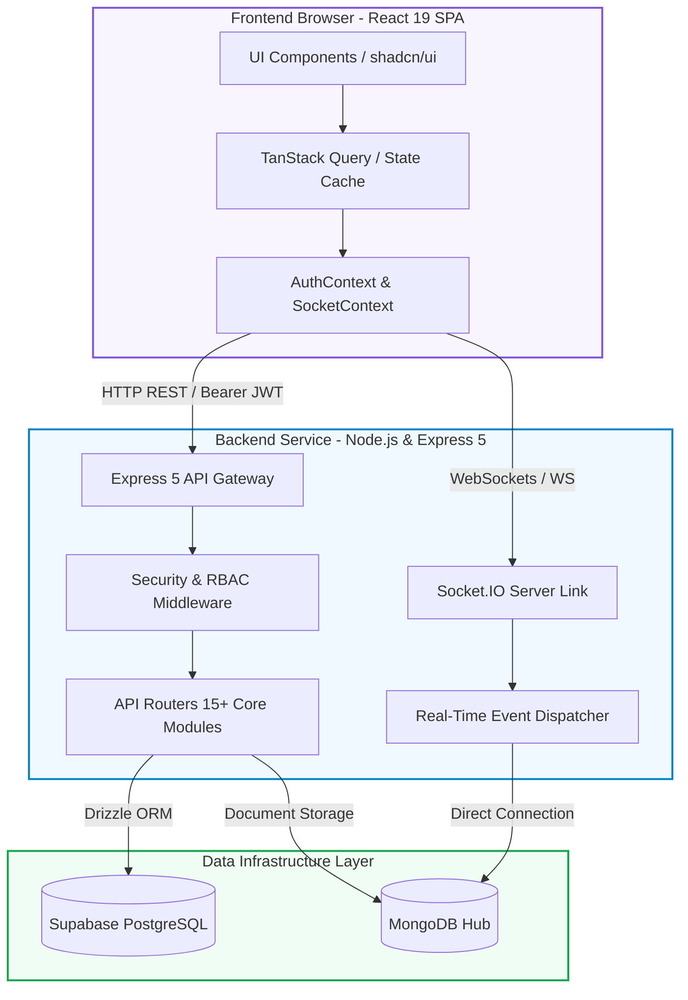

येथे तुझा संपूर्ण प्रोजेक्टचा `README.md` कोड एकाच **सिंगल फाईल / कॅनव्हास (Code Block)** मध्ये दिला आहे. तू हा कोड जसाच्या तसा कॉपी करून तुझ्या प्रोजेक्टच्या `README.md` फाईलमध्ये टाकू शकतोस:

````markdown
<div align="center">

# 🏥 MediCore HMS — Hospital Management System

### Full-stack, production-ready system built with React 19, Express 5, Drizzle ORM, Supabase PostgreSQL & MongoDB

[](https://hospital-management-system-seven-kappa.vercel.app/)
[](https://hospital-backend-p20c.onrender.com)
[](https://www.typescriptlang.org/)
[](https://react.dev/)
[](https://expressjs.com/)
[](https://supabase.com/)
[](https://www.mongodb.com/)

_Designed & Built by **Ambar Ubale** — Software Engineer_

</div>

---

## 📋 Overview

**MediCore HMS** digitises every core hospital operation — from appointment scheduling and patient records to prescriptions, billing, queue management and analytics. It replaces fragmented workflows with a single, secure, role-based platform.

**Live URLs**

- **Frontend:** [hospital-management-system-seven-kappa.vercel.app](https://hospital-management-system-seven-kappa.vercel.app/)
- **Backend:** [hospital-backend-p20c.onrender.com](https://hospital-backend-p20c.onrender.com)

---

## 📸 Screenshots

| Dashboard                               | Appointments                                  | Doctor Profile                                    |
| :-------------------------------------- | :-------------------------------------------- | :------------------------------------------------ |
|  |  |  |

> 💡 _Tip: Add your own screenshots inside the `screenshots/` folder and update paths above._

---

## 🔐 Demo Accounts

All test accounts use the password: **`password123`**

| Role                | Email                    | Access Level & Capabilities                                  |
| :------------------ | :----------------------- | :----------------------------------------------------------- |
| 👑 **Admin**        | `admin@hospital.com`     | Full system access, settings, logs & reports                 |
| 🩺 **Doctor**       | `dr.carter@hospital.com` | Manage appointments, patient history & prescriptions         |
| 🧑‍💼 **Receptionist** | `reception@hospital.com` | Live check-ins, token queue, billing & invoicing             |
| 🛌 **Patient**      | `john.doe@email.com`     | View personal medical records, book appointments & pay bills |

---

## ✨ Key Features

- **📅 Smart Appointments:** End-to-end lifecycle tracking (`Pending` ➔ `Confirmed` ➔ `Checked In` ➔ `In Consultation` ➔ `Completed`) with real-time Socket.IO updates.
- **👨‍⚕️ Unified Patient & Doctor Profiles:** Comprehensive medical histories, symptoms, treatment tracking, doctor availability scheduling, and insurance data management.
- **💊 Automated Billing & Prescriptions:** Digital prescriptions directly linked to appointments; automatic, tax-compliant invoice generation with flexible status handlers.
- **🔢 Real-time OPD Queue:** Token-based live queue management with instant push notifications backed by MongoDB and Socket.IO.
- **📊 Executive Analytics Dashboard:** Interactive revenue and performance charts powered by `Recharts` for administrative insights.
- **🛡️ Secure Access Control:** Role-Based Access Control (RBAC) paired with state-of-the-art JWT authentication (7-day lifecycle) and `bcryptjs` encryption.

---

## 🏗 System Architecture

The following diagram illustrates the modern dual-database multi-layered structure of MediCore HMS:


````

### 🔁 Request & Data Lifecycle

1. **Authentication State:** User logs in ➔ Server signs a 7-day JWT ➔ Saved securely in `localStorage`. Custom wrapper intercepts all headers.
2. **Operations & Pipeline:** Form interactions validated by `Zod` & `react-hook-form` ➔ Transmitted through custom fetch hooks ➔ Handled by Express routes.
3. **Reactive Interactivity:** On successful mutation ➔ Drizzle triggers database updates ➔ Socket.IO pushes a broadcast event ➔ Client-side TanStack cache auto-invalidates ➔ UI refreshes smoothly without full page reloads.

---

## 📁 Project Folder Structure

```text
Hospital-Management-System/
├── 📂 backend/
│   ├── 📂 src/
│   │   ├── 📜 app.ts              # Express initialization & Global Middleware Stack
│   │   ├── 📜 index.ts            # Server entry point (HTTP + Socket.IO server engine)
│   │   ├── 📜 db.ts               # Supabase PostgreSQL relational connector via Drizzle
│   │   ├── 📜 seed.ts             # High-fidelity mock clinical data injector
│   │   ├── 📂 routes/             # Isolated router nodes (15 functional endpoints)
│   │   ├── 📂 middlewares/        # JWT Authentication, RBAC Guardrails & Rate-limiters
│   │   ├── 📂 schema/             # Strictly typed relational database layout (9 core tables)
│   │   └── 📂 lib/                # Shared utilities: Pino logger, Mongo client, Socket logic
│   ├── 📜 drizzle.config.ts       # Database migrations & schemas sync setup
│   └── 📜 package.json            # Server-side execution engines & engine scripts
│
└── 📂 frontend/
    ├── 📂 public/                 # Static assets, branding vectors and manifest files
    ├── 📂 src/
    │   ├── 📜 main.tsx            # Application launchpad for React 19 ReactDOM
    │   ├── 📜 App.tsx             # Root layout configuration & Wouter routing nodes
    │   ├── 📜 index.css           # Tailwind CSS v4 design tokens and theme specs
    │   ├── 📂 api/                # Global automated state queries & transactional mutation hooks
    │   ├── 📂 components/         # High-performance components (shadcn/ui, Layouts, Charts)
    │   ├── 📂 hooks/              # Custom utilities (device context, alerts, global view state)
    │   ├── 📂 lib/                # React State Context blocks (Auth, Socket, Messaging)
    │   └── 📂 pages/              # Interface view controllers (Metrics, Check-ins, EHR)
    ├── 📜 vite.config.ts          # Core Vite bundler engine configs with local proxy logic
    └── 📜 package.json            # Client-side builds, dependencies and automation scripts

```

---

## 🛠 Tech Stack

### Frontend Ecosystem

- **Framework & Build Tool:** React 19, Vite
- **Language & Type-Safety:** TypeScript (v5.9+)
- **Styling & Design System:** Tailwind CSS v4, shadcn/ui
- **Fluid Animations:** Framer Motion
- **Server State & Caching:** TanStack Query
- **Routing:** wouter (Lightweight client-side router)
- **Form Management:** react-hook-form + Zod Validation

### Backend Ecosystem

- **Server Runtime:** Node.js, Express 5 (Next-gen HTTP architecture)
- **Data Access Layer:** Drizzle ORM (Type-safe SQL queries)
- **Primary Relational Database:** Supabase PostgreSQL
- **Real-time & NoSQL Layer:** MongoDB (Notifications & Event Logs) + Socket.IO
- **Security Infrastructure:** JWT (JsonWebToken), bcryptjs password hashing

---

## 💻 Local Development Setup

Follow these steps to set up the project locally:

### 1. Repository Setup

```bash
git clone <repo-url> Hospital-Hub
cd Hospital-Hub

```

### 2. Install Dependencies

```bash
# Install backend packages
cd backend && npm install

# Install frontend packages
cd ../frontend && npm install

```

### 3. Environment Configuration

Create a `.env` file in the `backend/` directory based on the `.env.example` file:

```env
SUPABASE_DATABASE_URL=your_supabase_postgres_connection_string
SESSION_SECRET=your_jwt_secret_key_here
MONGODB_URI=your_optional_mongodb_connection_string

```

### 4. Database Initialization

Synchronize your schema with Supabase and seed the demo dataset:

```bash
cd ../backend
npx drizzle-kit push
npm run seed

```

### 5. Launch the Applications

Run both servers concurrently during development:

- **Backend Server:** `cd backend && npm run dev:build` (Runs on Port `5000`)
- **Frontend Client:** `cd frontend && npm run dev` (Runs on Port `3000`)

Now, open your browser and navigate to: **`http://localhost:3000`**

---

## 🚀 Cloud Deployment

- **Frontend (Vercel):** Set root directory to `frontend`, configured build command to `npm run build`, and output folder to `dist`. Includes a `vercel.json` file for rewriting rules to route `/api/*` traffic cleanly to Render.
- **Backend (Render):** Set root directory to `backend`, build script to `npm install && npm run build`, and startup script to `npm run start`.
- **Database Layers:** Hosted in the cloud natively via Supabase & MongoDB Atlas clusters.

---

## 🔮 Future Roadmap

- [ ] Full EHR integration using structured **SOAP notes** guidelines.
- [ ] Comprehensive laboratory tracking, specimen status workflows, and imaging report uploads.
- [ ] Integrated Telemedicine portal with WebRTC video calling.
- [ ] Enterprise-grade CI/CD automation pipelines via GitHub Actions and Docker deployment strategies.

---

Made with ❤️ by **Ambar Ubale**
